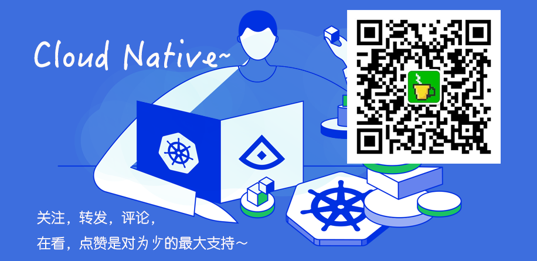

# Server

[nanoserver](https://github.com/lonng/nanoserver)



### 本地开发

☁️ Live reload for Go apps

```sh
go get -u github.com/cosmtrek/air

air
```

### 本地调试(Mac OS)

VSCode-Go Debugging
* [https://github.com/golang/vscode-go/blob/master/docs/debugging.md](https://github.com/golang/vscode-go/blob/master/docs/debugging.md)

注意看教程，非常简单。

### MySql

```sh
docker ps
docker-compose -f docker-compose.mysql.5.7.yaml down

docker-compose -f docker-compose.mysql.5.7.yaml up -d

docker volume ls

docker volume rm go-mahjong-server_db_data
```